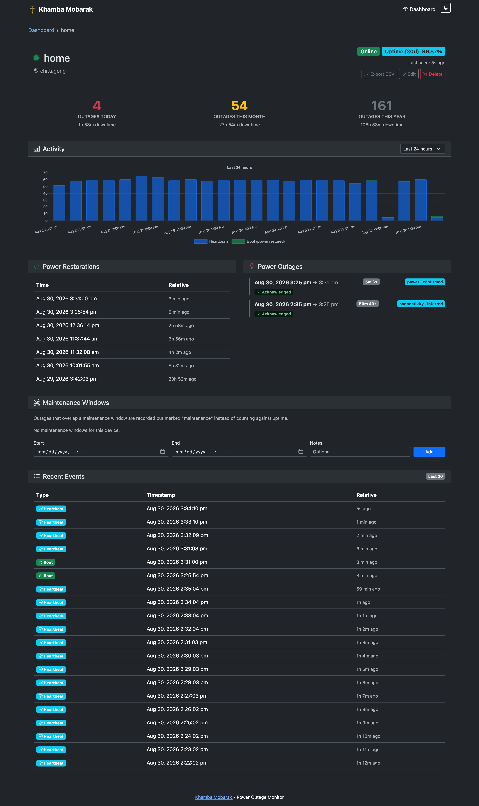

# Khamba Mobarak [](https://github.com/pyprism/KhambaMobarak/actions/workflows/server-tests.yaml) [](https://codecov.io/gh/pyprism/KhambaMobarak)

A power outage monitoring system using ESP8266/ESP32 devices and a Go server. Track power status across multiple locations with a web dashboard and centralized logging.

## Features

- ESP8266/ESP32 client: Sends "boot" events when power returns and regular heartbeats
- WiFiManager captive portal: First-time provisioning (no hardcoded router credentials)
- Go server: Single binary, embedded templates and static assets
- SQLite (GORM): Lightweight local storage
- CLI: Manage devices, tokens, and install as a systemd user service
- Bootstrap dashboard: Clean UI for status and outage history

## Screenshot

<div style="text-align:center;"></div>

## Supported Hardware

ESP8266 and ESP32

## Quick Start

### Server

1. Build the server binary:

```bash
cd server
go build -o khamba ./cmd/khamba/
```

2. Create a device and save its token:

```bash
./khamba device create --name "Living Room" --location "Home"
```

3. Run the server:

```bash
./khamba serve
```

4. Open the dashboard at http://localhost:8080

### ESP Client (first-time provisioning)

1. Install PlatformIO (VS Code extension or CLI)

2. Build and upload firmware for your board:

```bash
# Build for ESP8266 (NodeMCU v2)
cd client
pio run -e nodemcuv2

# Upload
pio run -e nodemcuv2 -t upload

# Or: build/upload for ESP32
pio run -e esp32dev
pio run -e esp32dev -t upload
```

3. First-time config:

- Power on the ESP device
- Connect your phone/laptop to WiFi SSID: `KhambaMobarak-Setup` (open network, no password)
- Open the captive portal (http://192.168.4.1)
- Enter your home WiFi SSID and password, server URL, and the device token created earlier
  - Plain `http://192.168.1.100:8080` works as-is for a server on your LAN
  - For a server reachable outside your LAN, use `https://...` and paste its CA certificate (PEM) into the setup form
- Save and the ESP will restart and connect to your network

4. Reconfiguration:

- Hold the `FLASH/BOOT` button for ~5 seconds during startup to clear saved WiFi + device config (`/config.json`) and restart into setup mode.
- The dedicated hardware `RST/EN` button only reboots the MCU; it cannot be used alone to detect a long-press in firmware.

## Development Makefile

There is a top-level `Makefile` with useful targets. From project root:

```bash
make help         # show available targets
make server       # build the server binary
make client-esp8266  # build client for ESP8266
make client-esp32    # build client for ESP32
make upload-esp8266  # upload (requires board connected)
make test         # run server unit tests
make coverage     # run tests with filtered coverage
```

Coverage ignore rules are defined in `server/.coveragerc` (used by `make coverage`).

## Server CLI Examples

```bash
# Start server
./khamba serve

# Clear analytics data (keeps devices/tokens)
./khamba clean

# Custom listen port / bind address / DB path
./khamba serve --port 9000 --host 0.0.0.0 --db /path/to/khamba.db

# Back up / restore the SQLite database (server must be stopped to restore)
./khamba backup /path/to/backup.db
./khamba restore /path/to/backup.db

# Device management
./khamba device create --name "Kitchen" --location "Home"
./khamba device list
./khamba device delete 1

# Send test events from CLI (auto reuses/creates token)
./khamba dummy-client
./khamba dummy-client --name "Lab Dummy" --event boot --count 3 --interval 2s
./khamba dummy-client --server http://192.168.1.100:8080 --name "Remote Test"

# Install/uninstall as systemd user service (Linux)
./khamba install
./khamba install --port 9000 --db /path/to/khamba.db
./khamba uninstall
```

`clean` (or `serve --clean` / `--reset-analytics`) removes event history and resets `last_seen` for all devices before server start, but keeps the device table and auth tokens intact.

`dummy-client` solves token setup automatically: it looks up a device by `--name` and reuses its existing token; if not found, it creates the device (using `--location`) and generates a token internally before sending events to `/api/events`.

`install` now accepts the same `--port` and `--db` overrides as `serve`, but it persists them into `~/.config/khamba/config.json` so the generated service can keep using plain `khamba serve`.

`backup` writes a consistent SQLite snapshot (safe to run while the server is up); `restore` replaces the configured database with a backup file and should only be run while the server is stopped.

`serve` also accepts `--offline-threshold <seconds>`, `--retention-days <n>` (0 disables event pruning), and `--display-timezone <IANA name>` — see Configuration below.


## How it works

1. Device loses power during outage and stops sending heartbeats
2. When power returns the ESP boots and sends a `boot` event
3. Device sends `heartbeat` events every 60s
4. Server marks device offline if no heartbeat for the configured threshold (default 3 minutes)
5. Dashboard shows outages, durations and device status

## Configuration

Server config: `~/.config/khamba/config.json`

```json
{
  "port": 8080,
  "host": "",
  "db_path": "/home/user/.local/share/khamba/khamba.db",
  "offline_threshold_seconds": 180,
  "retention_days": 7,
  "display_timezone": ""
}
```

`host` empty binds all interfaces (needed for ESP devices on the LAN to reach it). `display_timezone` is an IANA name (e.g. `"America/New_York"`); empty means UTC.

Client config: stored in LittleFS on the device at `/config.json` (contains `serverUrl` and `deviceToken`).

## Building for production

Server (single binary):

```bash
cd server
go build -ldflags="-s -w" -o khamba ./cmd/khamba/
```

Client (PlatformIO):

```bash
cd client
pio run -e nodemcuv2 -t upload
```

## License

MIT

## "Electric pole" icons by [icon blast](https://www.flaticon.com/free-icons/electric-pole) from [Flaticon](https://www.flaticon.com/).
